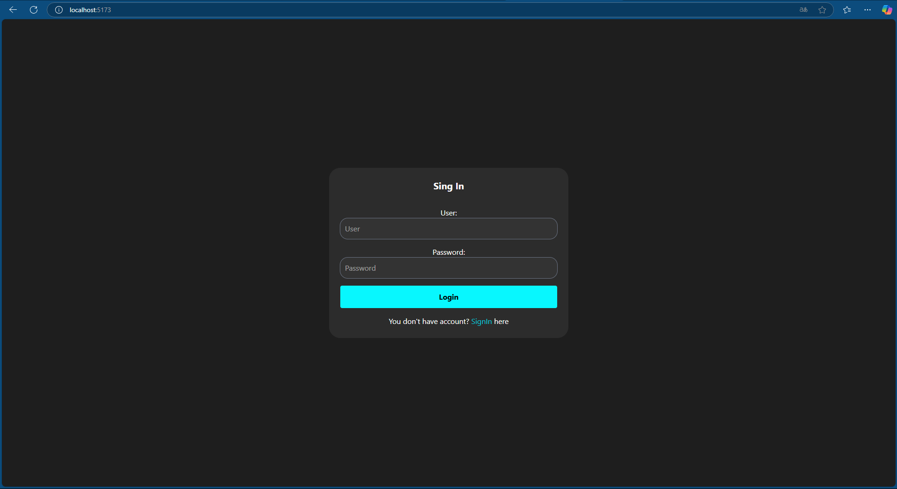
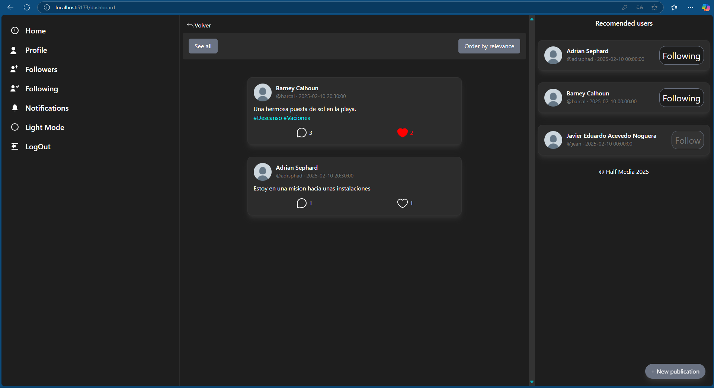

# Proyecto Frontend - Half Media 🚀

## Tabla de contenidos 📚
- [Descripcion](#descripcion)
- [Tecnologias](#tecnologias)
- [Instalacion](#instalacion)
- [Screenshots](#screenshots)
- [Enlaces](#enlaces)
- [Autor](#autor)
- [Contacto](#contacto)

<h2 id="descripcion"> Descripción del Proyecto 📖 <h2>

Este es el frontend de la red social Half media construida con **React.js** y **Vite.js**. El frontend consume los endpoints del backend desarrollado en **Spring Boot** y utiliza **TailwindCSS** para el diseño visual.

<h2 id="tecnologias"> Tecnologías Utilizadas 💻 <h2> 

- **React.js** - Biblioteca de JavaScript para la interfaz de usuario.
- **Vite.js** - Herramienta de construcción y desarrollo rápido.
- **TailwindCSS** - Framework CSS para el diseño.
- **Axios** - Para las solicitudes HTTP al backend.

<h2 id="instalacion"> Instrucciones de Instalación y Configuración 💾 <h2>

Requisitos
- **Node.js** (versión 16 o superior)
- **npm**

### Pasos para ejecutar el backend:
1. Clona este repositorio:
   ```bash
    git clone https://github.com/JavierEAcevedoN/My_Social_Media_Frontend.git
    cd msmf
    ```
2. Instala las dependencias:
    ```bash
    npm install
    ```
3. Configura la URL del backend:
    Ve a [Api.js](./msmf/src/api.js) y cambia la configuracion del puerto:
    ```js
    const API_BASE_URL = "http://localhost:{puerto del backend}/api";
    ```
    Ve a [Api.js](./msmf/src/context/AuthContext.jsx) y cambia la configuraciones de los puertos:
    ```js
    const { data } = await axios.post("http://localhost:{puerto del backend}/auth/login", { username, password });

    const { data } = await axios.post("http://localhost:{puerto del backend}/auth/register", { username, email, fullName, password, phone, birthDate });
    ```
4. Inicia el servidor de desarrollo:
    ```bash
    npm run dev
    ```

<h3 id="screenshots">Screenshots 📷</h3>


Pagina del login de Half Media


Pagina del Dashboard de Half Media

<h3 id="enlaces">Enlaces 📎</h3>

Puedes ver un videdo de demostracion del aplicativo aqui:
- [Video Half Media](https://youtu.be/pxm55VpQPyQ)

Puedes encontrar el repositorio del frontend aqui:
- [Repositorio Backend](https://github.com/JavierEAcevedoN/My_Social_Media_Backend)  
Ultimo Hash: ``d115fecada4f3df8eb11541679310e3e6a113a1d``

<h3 id="autor">Autor 👤</h3>

- [JavierEAcevedoN](https://github.com/JavierEAcevedoN)

<h3 id="contacto">Contacto 📱</h3>

- Linkedin: [Javier Eduardo Acevedo Noguera](https://www.linkedin.com/in/javier-eduardo-acevedo-noguera)